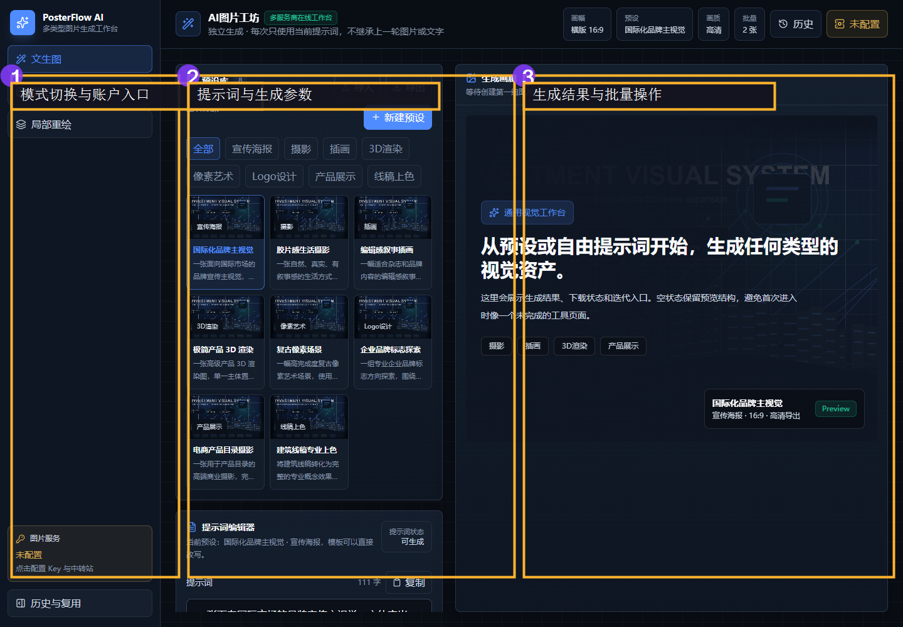
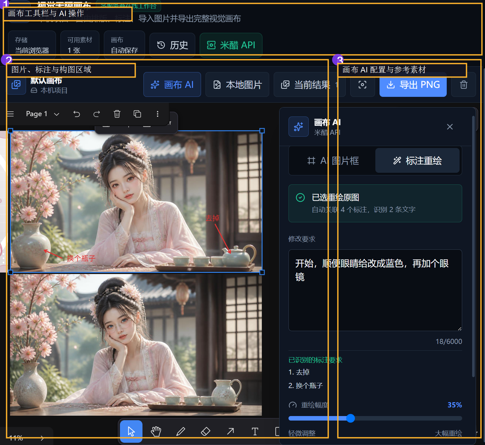
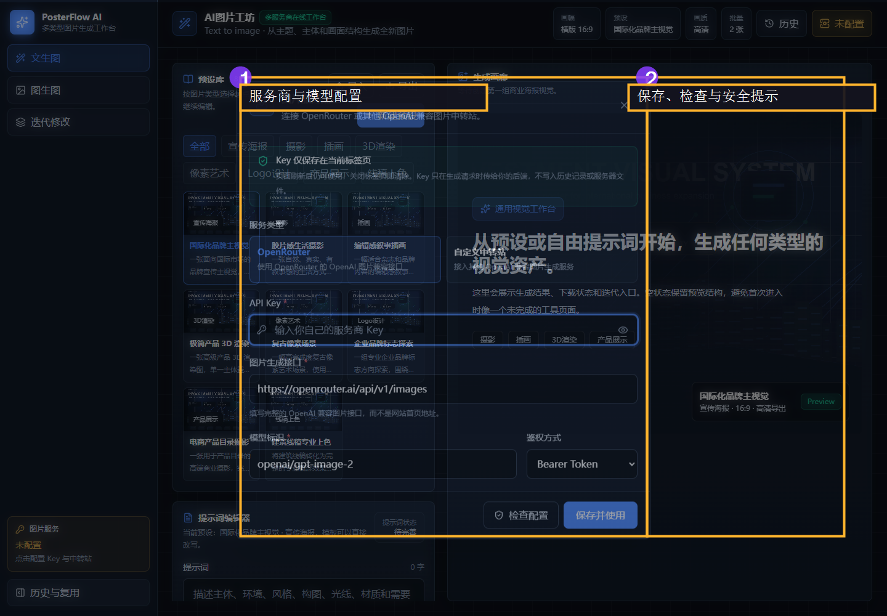
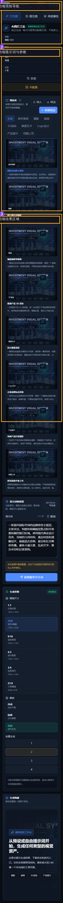
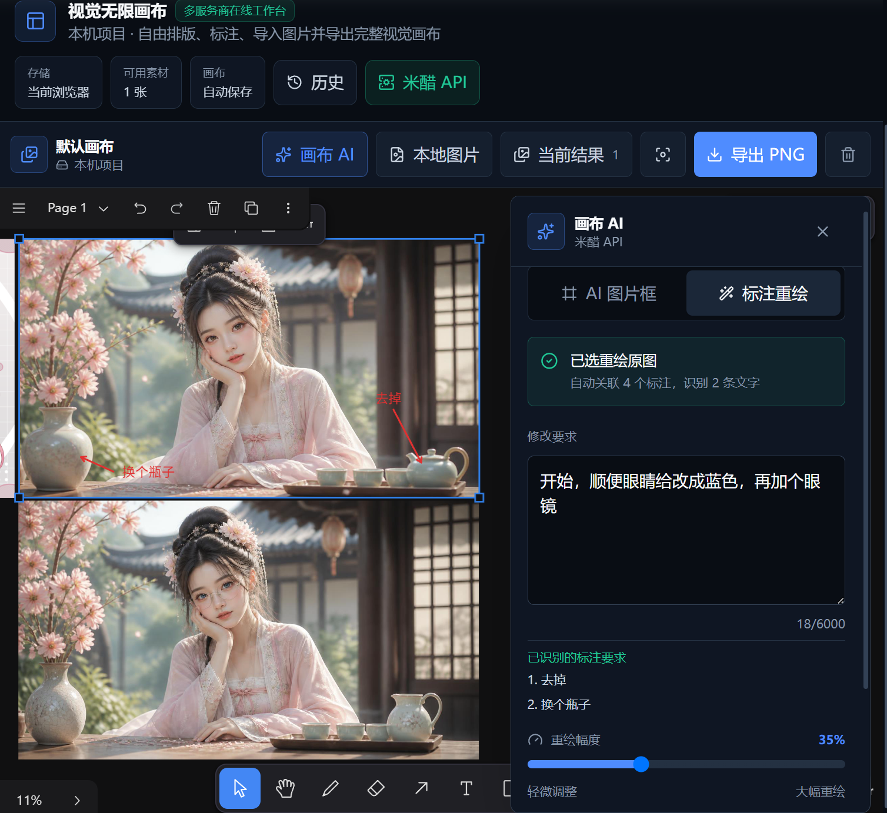
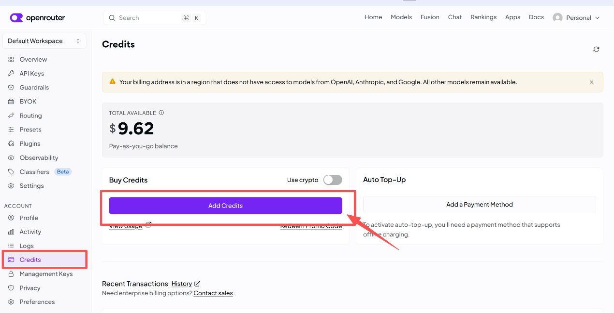
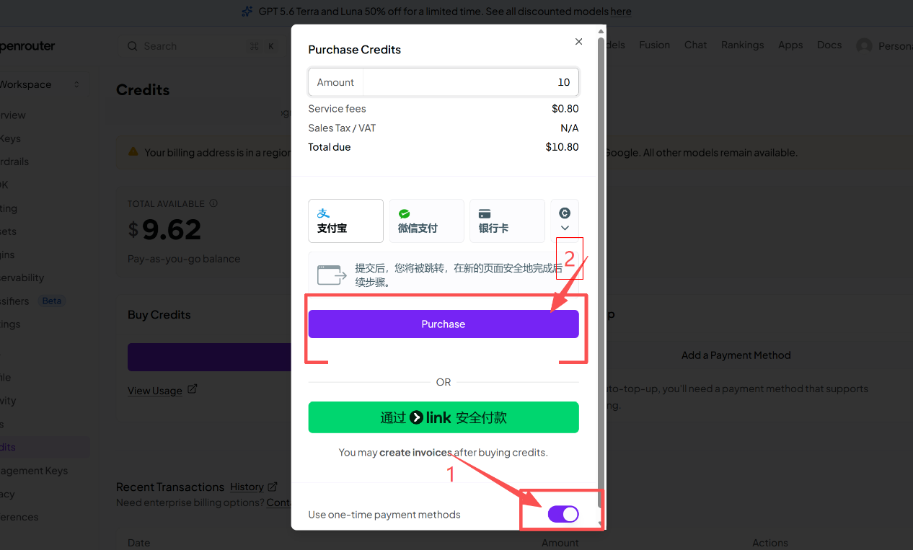
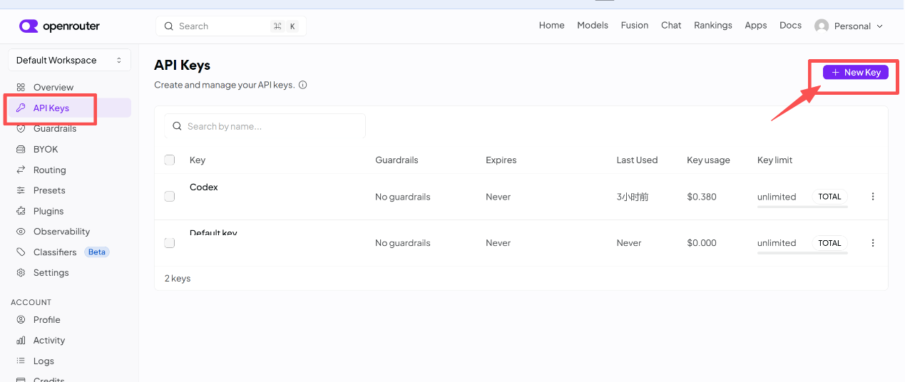

# PosterFlow AI

## 在线使用

访问 **[PosterFlow AI 在线版](https://www.posterflow-ai.xyz)**，无需下载或安装。打开网页后，在“图片服务”中配置自己的 API Key、图片生成接口和模型标识，即可直接开始创作！

> API Key 仅保存在当前浏览器标签页的会话存储中，不会写入生成历史或云端图片存储。请仅使用可信服务商提供的 HTTPS 接口。

此工具为 AI 图片工作台。前端使用 React、Vite 和 Tailwind CSS，后端使用 Flask 转发 OpenAI 兼容图片生成请求。
此工具对比市面上其他同等质量工具拥有花费极低、速度极快且自定义强的优势，但需要自行配置API，请认真阅读以下教程。

## 主要功能

## 界面速览

下面的图片来自项目实际运行页面，标注用于说明主要入口和操作区域。










- 文生图、图生图和基于上一版的迭代修改
- 提示词模板、商务风格、尺寸、画质和批量数量
- 原图预览、单图下载、批量 ZIP 导出和历史复用
- OpenRouter、米醋 API 预设及自定义 OpenAI 兼容中转站
- 无限画布排版、标注、本地图片导入、生成结果回收与 PNG 导出
- 画布 AI 图片框、按比例生成、标注重绘与新旧版本并排对比
- 用户 Key 会话级保存，不写入历史记录或服务器文件

## 两种生图逻辑

左侧模式切换对应两种不同的控制方式：

### 1. 独立生成：文生图 / 图生图

- `文生图` 每次点击“生成图片”都只提交当前文本框中的整段提示词。
- `图生图` 每次也只提交当前提示词，并额外使用你本次选择的参考图；现在最多可同时上传 8 张素材，点击缩略图可在提示词光标处插入 `@图1`、`@图2` 等引用。生成时素材按上传顺序对应编号，可描述“把 @图2 中的人物放到 @图1 的椅子上”。
- 第二次、第三次生成不会自动继承上一轮图片、上一轮文字或上一轮风格。你可以彻底改写主题、构图和风格。

### 2. 局部重绘

- 第一次点击时可以不使用参考图，也可以上传参考图。
- 第一轮生成完成后，再次点击主按钮会自动引用上一轮生成的图片。
- 第二轮只把当前文本框内容作为本次追加修改要求，例如“只把背景换成夜景，保留主体和构图”。
- 局部重绘会根据原图和本次要求自行判断修改范围，不再提供容易限制结果的参考强度滑杆。
- 也可以在画廊或原图预览中针对某一张图片单独发起局部重绘。

## 无限画布

左侧“无限画布”是独立的视觉编排工作区。绘制、排版、导入、自动保存和 PNG 导出都在当前浏览器完成，不会触发图片模型；只有主动使用“画布 AI”生成或重绘时才会调用用户配置的图片服务。

- 可以使用选择、平移、红色箭头和红色文字工具排版与标注；滚轮缩放，按住 `Alt` 或鼠标中键可临时平移。
- 在生成画廊中点击单张图片的画布按钮，或勾选多张后点击“加入画布”，即可继续组合设计。画布中可用 Shift/Ctrl（Mac 为 Command）多选图片，再进入“画布 AI”重绘；所选图片会按选择顺序成为 `@图1`、`@图2` 等参考素材，最多 8 张。
- 可以从电脑批量导入 PNG、JPG、WebP、GIF 或 SVG 图片。
- 新建箭头和文字默认使用醒目的红色与加大尺寸，便于图片模型识别标注位置和修改要求。
- “导出 PNG”会优先导出当前选区；没有选中内容时导出当前画布全部内容。
- 画布自动保存在当前浏览器的 IndexedDB 中，刷新页面后仍可恢复；它不会上传到 PosterFlow AI 后端或 Vercel Blob。
- 清除浏览器站点数据会同时删除本机画布。需要长期保留时，请及时导出 PNG。



*无限画布示例：导入原图后使用红色箭头和文字定位修改区域，在画布 AI 中检查参考图并生成重绘版本。*

### AI 图片框

1. 点击画布顶部“画布 AI”，切换到“AI 图片框”。
2. 选择 `1:1`、`3:2`、`2:3`、`4:3`、`3:4`、`16:9` 或 `9:16`，点击“新建”。
3. 新图框会自动成为当前生成目标。输入完整提示词并选择画质，点击“生成到选中图框”。
4. 程序会按照图框比例请求图片服务，并在成功后用生成图片原位替换图框。其他画布内容不会被覆盖或删除。

### 标注重绘

1. 在画布中选择一张原图。程序会自动关联原图范围内及周边的箭头、文字、线条或色块；需要精确限定时，也可以按住 `Shift` 手动多选指定标注。
2. 打开“画布 AI”，切换到“标注重绘”，填写本轮修改要求；模型会根据原图和标注自行判断修改范围。
3. 点击“检查参考图”，先核对模型将收到的干净原图、标注说明图、识别文字和压缩后体积；该操作只在浏览器内处理，不调用图片 API。
4. 点击“生成重绘版本”。程序会分别导出一张干净原图和一张包含箭头、文字等标注的说明图，并作为两张参考图提交给当前图片服务。
5. 提示词会逐条写入识别到的标注文字，并明确箭头尖端对应修改目标；模型以干净原图为唯一画面基准，只把第二张图用于理解修改位置，最终移除箭头和文字等编辑痕迹。
6. 新版本会放在原图右侧，默认间距为 40 个画布单位。原图与标注保持原位，便于继续比较和迭代。

画布 AI 的数据边界：

- 参考图只在本次请求期间传给 PosterFlow AI 后端和用户选择的图片服务，不写入历史记录，也不会作为参考图单独保存到 Vercel Blob。
- 图片服务返回的新图片与普通生成结果一样写入历史记录，并按最近 30 天策略保留。
- 图框生成和标注重绘各调用一次图片生成接口，会产生对应服务商的调用费用或额度消耗。
- 画布 AI 的提示词草稿保存在当前浏览器 `localStorage`；API Key 仍只保存在当前标签页 `sessionStorage`。
- 画布参考图仅接受 PNG、JPG、WebP 或 GIF 内容。提交前会在浏览器内限制最长边并自动压缩，以兼容本地后端的 16 MB 单图校验和 Vercel 的请求体限制。
- 标注重绘使用 OpenAI 兼容的 `POST /v1/images/edits` multipart 接口；自定义中转站除了生成接口外，还必须支持该编辑接口和多张 `image[]` 参考图，否则只能使用普通文生图与图框生成功能。

> 无限画布基于 MIT 许可证的 Fabric.js 实现，不需要为公开生产域名配置画布许可证。

## 快速开始

### Windows 一键启动

```bat
start-dev.bat
```

首次运行时，脚本会在项目根目录创建 `.venv`，并把后端 Python 包安装到该虚拟环境；前端依赖安装到 `frontend\node_modules`，npm 下载缓存保存在 `.npm-cache`。这些依赖都不会安装进系统 Python 或全局 npm。

脚本不会自动安装 Python 和 Node.js 本身。运行前需要先安装：

- Python 3.11 或更高版本
- Node.js 20.19 或更高版本（自带 npm）

只安装依赖而不启动服务：

```bat
start-dev.bat --setup-only
```

只检查系统运行时与项目文件：

```bat
start-dev.bat --check
```

### 手动启动

先创建项目内虚拟环境并安装依赖：

```powershell
python -m venv .venv
.\.venv\Scripts\python.exe -m pip install --no-cache-dir -r backend\requirements.txt
cd frontend
npm ci --cache ..\.npm-cache
npm run dev
```

另开一个终端，在项目根目录启动后端：

```powershell
.\.venv\Scripts\python.exe backend\server.py
```

访问 `http://localhost:3000`。首次生成时点击“图片服务”，选择 OpenRouter 或自定义中转站，填写自己的 Key、完整接口地址和模型标识。

## 普通用户详细使用步骤

如果你是从 GitHub 下载项目，而不是参与开发，请按下面的顺序操作：

1. 在 GitHub 仓库页面点击 `Code` → `Download ZIP`，解压到本地目录。也可以使用 `git clone <your-repository-url>` 下载。
2. 安装 Python 3.11 或更高版本，以及 Node.js 20.19 或更高版本。它们是系统运行时，不会被项目脚本静默安装。Windows 用户可在 PowerShell 中执行 `python --version` 和 `node --version` 检查版本。
3. 双击根目录的 `start-dev.bat`。首次运行会创建 `.venv`、安装后端与前端依赖，并启动本地服务；后续运行会复用项目内环境。
4. 浏览器打开 `http://localhost:3000`。如果页面没有自动打开，请手动输入该地址。
5. 点击左侧“图片服务”或顶部服务按钮，选择 OpenRouter 或“自定义中转站”。填写自己的 API Key、完整图片接口地址、模型标识和鉴权方式，再点击“检查配置”与“保存并使用”。
6. 在“预设库”中按类别选择图片方向。预设会自动载入提示词，但提示词仍然可以在“提示词编辑器”中自由修改。
7. 如果需要长期复用自己的工作方法，点击“新建预设”，填写预设名称、类别和提示词模板；示例封面可以按需上传，不上传也能保存。自定义预设只保存在当前浏览器的本地 IndexedDB 中，不会上传到 GitHub 或服务端。
8. 在“生成参数”中选择预设画幅或填写自定义宽高，并设置画质和生成数量；图生图模式还可以上传多张参考图，并在提示词中使用 `@图1`、`@图2` 引用。
9. 点击“生成图片”。生成结果会出现在右侧画廊，可以放大预览、下载单图、勾选多张后批量导出 ZIP。在线版的历史记录与图片保存在私有 Vercel Blob，本地运行时保存在项目的 `backend/history.json` 与 `backend/outputs/`。历史和对应图片自动保留最近 30 天，打开历史记录或完成新生成时会清理过期内容。
10. 需要继续编排时，点击图片上的画布按钮，或勾选多张图片后点击“加入画布”。画布会在当前浏览器自动保存，可导出选区或整页 PNG。
11. 需要按固定比例生成时，在“画布 AI”中创建 AI 图片框；需要局部修改时，选择一张原图和可选标注，再使用“标注重绘”。这两项操作都会调用图片服务。
12. 关闭当前浏览器标签页会清除当前标签页保存的 API Key；如果更换电脑或浏览器，需要重新配置。自定义预设与无限画布保存在本机浏览器中，清除浏览器站点数据前请先导出需要保留的内容。

如果只想体验界面，可以不配置 Key，先选择预设、编辑提示词和参数；真正生成图片时才需要可用的图片服务配置。

## 安装位置与卸载

项目运行产生的主要文件均位于项目目录：

| 内容 | 位置 |
| --- | --- |
| Python 第三方包 | `.venv/` |
| 前端 npm 包 | `frontend/node_modules/` |
| npm 下载缓存 | `.npm-cache/` |
| 前端生产构建 | `frontend/dist/` |
| 生成图片 | `backend/outputs/` |
| 后端历史记录 | `backend/history.json` |
| 无限画布 | 当前浏览器 IndexedDB |
| 画布 AI 提示词草稿 | 当前浏览器 localStorage |

退出正在运行的终端和服务后，删除整个项目文件夹即可移除项目代码、项目依赖、生成图片和后端历史，不需要执行全局 Python 或 npm 卸载命令。系统中原本安装的 Python、Node.js 和浏览器不会被删除。

API Key 保存在当前浏览器标签页的 `sessionStorage`，关闭标签页后清除。自定义预设和无限画布保存在浏览器 IndexedDB 中，画布 AI 提示词草稿保存在 localStorage；这些内容不在项目文件夹内。如需彻底清除，请在浏览器中删除 `localhost:3000` 和 `127.0.0.1:5000` 的站点数据。

## Key 与中转站

推荐让每位用户在页面中填写自己的 Key。配置保存在当前标签页的 `sessionStorage`，关闭标签页后自动清除。后端只在生成请求期间读取 Key，不会将其写入 `history.json`。

### 如何获取 OpenRouter API Key

下面以 OpenRouter 为例。页面布局和可用支付方式可能随地区、账号及平台更新而变化，请以 OpenRouter 实际页面为准；如果使用其他中转站，请查阅对应服务商的 Key 创建说明。

1. 打开 [OpenRouter](https://openrouter.ai/) 并注册或登录账号。如果网站无法访问，请先检查当前网络环境和浏览器设置。
2. 进入账户的 `Credits` 页面，点击 `Add Credits`，按页面提示选择金额和支付方式完成充值。创建 Key 本身不一定要求充值，但调用付费模型前需要有可用余额。



部分账号可在支付窗口底部开启 `Use one-time payment methods`，再选择页面提供的一次性支付方式。



3. 进入 `API Keys` 页面，点击右上角 `New Key`。建议填写便于识别的名称，例如 `PosterFlow AI`，并根据自己的预算设置额度上限或到期时间。



4. 创建后立即复制并妥善保存 Key。完整 Key 通常只显示一次，不要把它发送给他人，也不要写进截图、README、Issue、聊天记录或前端代码。
5. 回到 PosterFlow AI，打开“图片服务”，选择 `OpenRouter`，粘贴 Key。OpenRouter 预设会自动填写接口地址和模型；点击“检查配置”，确认无误后再“保存并使用”。

如果 Key 意外泄露，请立即回到 OpenRouter 的 `API Keys` 页面删除或吊销旧 Key，并创建新 Key。建议始终设置合理额度，避免异常调用造成额外费用。

自定义中转站需要兼容 OpenAI 图片请求：接收 `model`、`prompt`、`n`、`size`、`quality` 等字段，并在 `data` 或 `images` 中返回 `b64_json`、`base64` 或公网图片 `url`。

也可以复制 `.env.example` 为 `.env`，为单用户部署设置服务器默认服务：

```env
IMAGE_API_KEY=your-key
IMAGE_API_ENDPOINT=https://your-provider.example/v1/images/generations
IMAGE_API_MODEL=your-image-model
IMAGE_API_AUTH_TYPE=bearer
```

兼容旧配置名 `OPENROUTER_API_KEY`，但新部署建议使用通用的 `IMAGE_API_*`。


## 生产构建

```bat
build.bat
.venv\Scripts\python.exe backend\server.py
```

`build.bat` 会先调用 `start-dev.bat --setup-only` 准备项目内依赖，再生成 `frontend/dist`。构建后，Flask 会从该目录提供前端页面。这个方式适合本地生产预览；公网 Linux 部署应使用 Docker 或 Gunicorn。

Docker 一键启动：

```bash
docker compose up --build -d
```

访问 `http://localhost:5000`。运行数据保存在 Docker volume `posterflow-data`。

在 Docker 中使用服务器默认 Key 时，先在项目根目录创建 `.env`：

```powershell
Copy-Item .env.example .env
# 用编辑器填写 IMAGE_API_KEY、IMAGE_API_ENDPOINT 和 IMAGE_API_MODEL
docker compose up --build -d
```

公网部署时建议让用户在页面中填写自己的 Key，或者为你的服务增加登录、限流、额度和计费后再使用服务器默认 Key。不要把 Key 写进前端代码、Vite 的 `VITE_*` 变量或 GitHub Pages。

## GitHub 发布

```bash
git init
git add .
git commit -m "release: PosterFlow AI v0.2.0"
git branch -M main
git remote add origin <your-repository-url>
git push -u origin main
```

GitHub Pages 只能托管静态前端，不能运行 Flask 或安全保存 Key。公开网站应部署完整 Docker 镜像，或把前端和后端分别部署到静态托管与云服务平台。

发布前还需要选择并添加合适的开源 `LICENSE`，并在 GitHub 仓库启用 Secret scanning 和私密漏洞报告。

## 项目结构

```text
backend/          Flask API、运行数据目录
frontend/         React 前端
legacy/           已去除密钥的早期命令行脚本
docs/             UI 规范和发布截图
.github/workflows GitHub Actions
.venv/            本机 Python 虚拟环境（首次运行生成，不提交 Git）
.npm-cache/       本机 npm 缓存（首次运行生成，不提交 Git）
Dockerfile        一体化生产镜像
```

## 验证

```powershell
cd frontend
npm run lint
npm run build
cd ..
.\.venv\Scripts\python.exe -m compileall -q backend legacy
```

安全要求和已知部署边界见 [SECURITY.md](SECURITY.md)，界面规范见 [docs/UI_DESIGN_SPEC.md](docs/UI_DESIGN_SPEC.md)。
